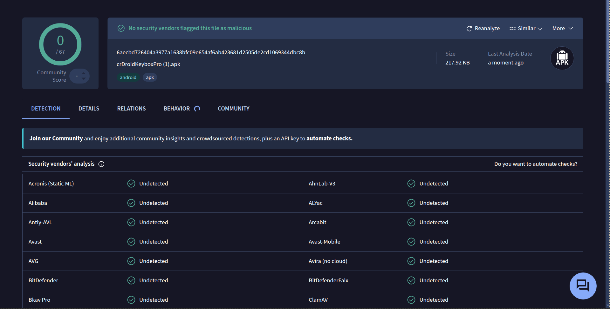

# 🛡️ crDroid Keybox Manager

[](assets/virustotal_scan.png)
[](https://crdroid.net)
[](https://github.com/cyberjoseanibal/crDroid-Keybox-Manager)
[](LICENSE)

Un gestor y sincronizador automático de **Keybox.xml** y **Target Apps** diseñado específicamente para la ROM **crDroid 12.1 (Android 16)** y dispositivos Android con **KernelSU / APatch / Magisk**.

---

## 🔒 Análisis de Seguridad (VirusTotal Verified)

El APK de **crDroid Keybox Manager** ha sido escaneado en VirusTotal para garantizar la máxima seguridad e integridad del código. **0 de 67 proveedores de seguridad** han detectado amenazas (100% Limpio y Seguro).

<p align="center">
  
</p>

- **Archivo analizado:** `crDroidKeyboxPro.apk`
- **Hash SHA-256:** `6aecbd726404a3977a1638bfc09e654af6ab423681d2505de2cd1069344dbc8b`
- **Resultado:** 🟢 **0/67 Detecciones (Verificado 100% Seguro)**

---

## 🌟 Características Principales

- 🔄 **Sincronización Automática cada 3 Horas:** Monitorea de forma ligera el repositorio de GitHub y reemplaza la clave `Keybox.xml` automáticamente si detecta revocaciones o actualizaciones.
- ⚙️ **Integración Directa con Ajustes de crDroid:** Escribe en `Settings.Secure` (`spoof_trickystore_keybox` y `spoof_trickystore_target`) para que el estado aparezca inmediatamente reflejado en **Ajustes de crDroid -> Varios -> TrickyStore**.
- 🎯 **Configuración de Target Apps en 1-Clic:** Aplica automáticamente la lista de aplicaciones objetivo (Google Wallet, GMS, Play Store, ARCore).
- 🗑️ **Opción para Eliminar Keybox:** Permite borrar la clave del sistema y restaurar el estado inicial en cualquier momento.
- 🎨 **Interfaz Material 3 Dark:** Diseño limpio, moderno y intuitivo, con registro de eventos en tiempo real.
- ⚡ **Eficiencia de Batería (0.0%):** Utiliza firmas criptográficas SHA-256 para evitar escrituras y consumo de recursos innecesarios.

---

## 🔄 Funcionamiento de la Sincronización Automática

Así es como funciona el sistema de actualización en segundo plano con **WorkManager**:

- **Cuando GitHub se actualiza (suben un nuevo Keybox):**
  - En la siguiente verificación periódica de **WorkManager** (ej. cada 3 horas), la app calcula el nuevo hash SHA-256 de GitHub.
  - Al ser diferente al hash guardado en tu dispositivo, detecta el cambio automáticamente, aplica el nuevo `Keybox.xml` en las rutas Root y en `Settings.Secure` de crDroid, y guarda el nuevo hash.

- **Mientras GitHub NO cambie:**
  - La app revisa el archivo, ve que los hashes son idénticos y no realiza ninguna escritura, evitando actualizar en bucle o consumir batería innecesariamente.

---

## 🚀 Instalación y Uso

1. Descarga el archivo APK listo para instalar desde la sección de [Releases](../../releases).
2. Instala el APK en tu dispositivo Android.
3. Abre la aplicación y concédele acceso **Superusuario (Root)** cuando KernelSU / APatch / Magisk lo solicite.
4. Presiona **Sincronizar Keybox Manualmente** o activa la **Auto-Sincronización** para dejar que la app gestione todo en segundo plano.

---

## 🛠️ Estructura del Proyecto

```text
crDroidKeyboxApp/
├── assets/
│   └── virustotal_scan.png
├── app/
│   ├── src/main/
│   │   ├── AndroidManifest.xml
│   │   ├── java/com/crdroid/keyboxupdater/MainActivity.java
│   │   └── res/
│   │       ├── layout/activity_main.xml
│   │       └── values/
```

---

## 📜 Licencia

Este proyecto está distribuido bajo la licencia MIT.
